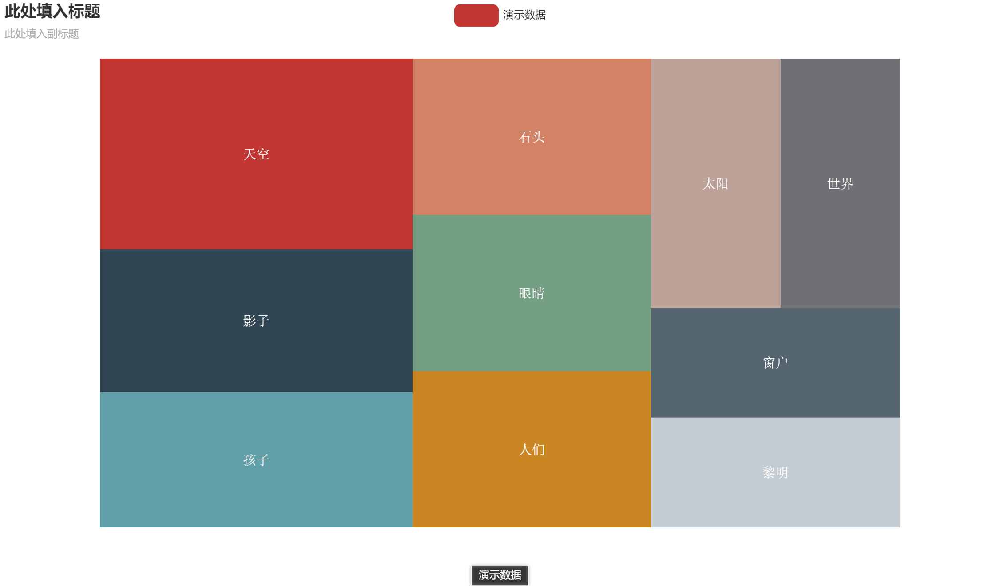

# 前言：

本项目主要是对Wordcloud和Pyechart做了一些参数上的封装使得没有编程基础的人也可以绘制一些美观的图。本项目开始于Python程序设计公选课，中间因为考试的原因中断。考试结束后将代码整理至Github开源。因为是因为我的重心转向了Qt，而python将成为我的脚本语言工具，而不是用来开发复杂的GUI。
# 第三方资源：
* ①图标 图标资源大多来源于 easyicon
* ②背景图  因为我没有美术功底，所以背景图取至免版权图库 Pixabay
* ③词云文本 。文档中带有四份文本《月光》《北岛诗集》《一直特立独行的猪》《我的孤独是一座花园》均来源于网络，如有侵权，请联系我删除。

# 功能特点
## 界面

## 支持图形类别

* 词云图

* 关系图

* 桑基图

* 旭日图

* 树图（包括矩形树）

* 饼图

* 坐标系系列图（ 折线图，散点图，散点涟漪图，柱状图/条形图，象形柱状图）
---
* 折线图

---
* 散点图

---
*条形图

---
* 条形图-带时间线

## 词云图系列支持的图形配置
* 设置屏蔽词，最大词数，缩放倍数，词频与字体大小相关性
* 轮廓高度/宽度
*  配色（Matplotlib 系列配色/按模板颜色配色）
*  统计词频，根据词频绘图。

## Pyechart系列支持的图形配置

### 全局配置
* 标题
* 轮廓宽度
* 主题样式
* 视觉映射，Ｘ－Ｙ翻转，区域缩放，时间线，工具箱开启/关闭

### 绘图模式模式
* 在线
* 离线（plotly_html\js 目录下）

